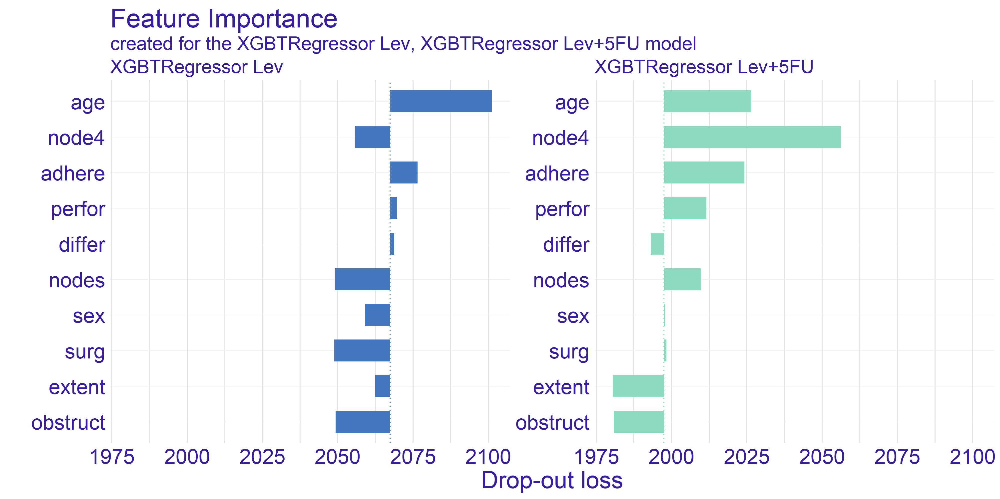
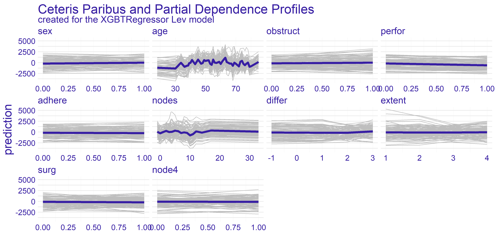
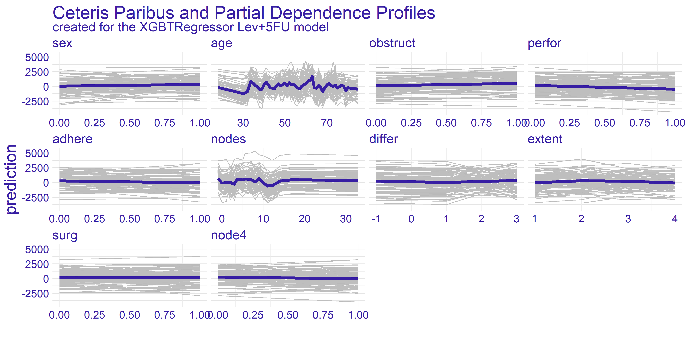
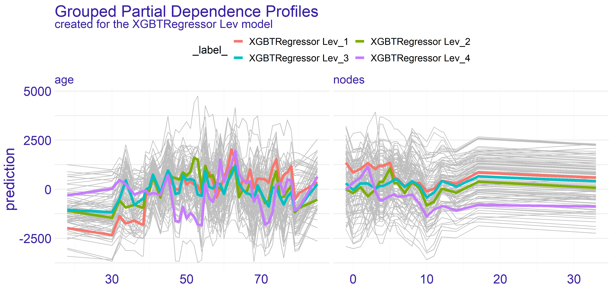
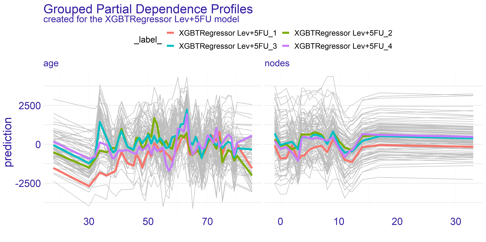
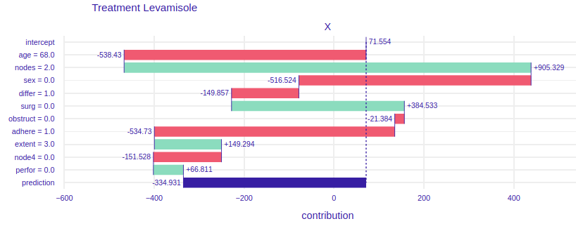
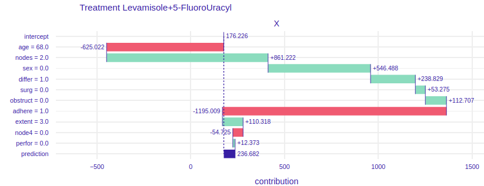
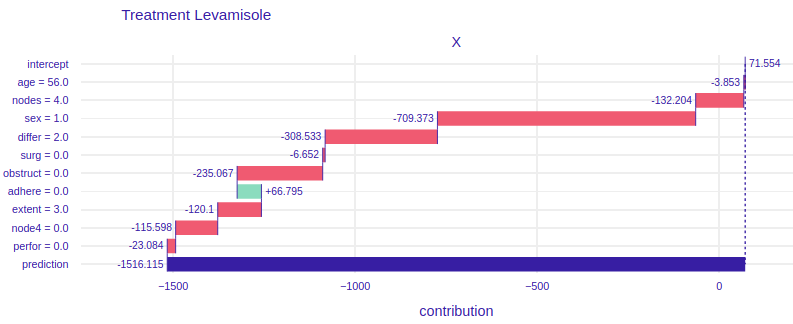
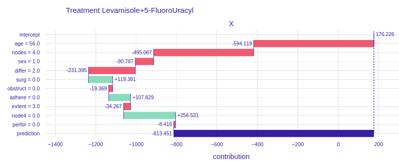
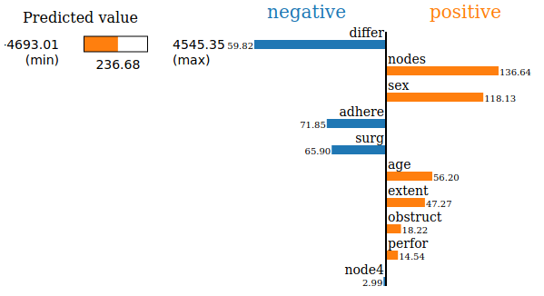

# Story Uplift Modelling: eXplaining colon cancer survival rate after treatment {#story-uplift-modelling}

*Authors: Aleksandra Łuczak (Warsaw University of Technology), Tymoteusz Makowski (Warsaw University of Technology), Kateryna Shulikova (Warsaw School of Economics)*

*Mentors: Miłosz Dobersztyn (McKinsey), Armin Reinert (McKinsey)*

```{r, echo = FALSE}
# Function used to set columns' widths in HTML knitr::kable tables.
# Source of the function: https://github.com/rstudio/bookdown/issues/122#issuecomment-221101375
html_table_width <- function(kable_output, width){
  width_html <- paste0(paste0('<col width="', width, '">'), collapse = "\n")
  sub('<table>', paste0('<table class="table">\n', width_html), kable_output)
}
```

## Introduction 
We will use data about **Chemotherapy for Stage B/C colon cancer** from `survival` package in R. The documentation can be found [here](https://stat.ethz.ch/R-manual/R-devel/library/survival/html/colon.html), the package can be installed with `install.packages("survival")` command in R console. After the installation dataset can be accessed via `survival::colon` command.

<!--
    TODO: Describe why this problem is important. Indicate the most important literature on the problem. 
    TODO(oryginał): Put a description of the problem here. *Indicate the data source.*
-->


### What is Uplift Modelling?

For classical algorithms in machine learning it is hard to predict causal impact of the event because they are more suited for predicting the results after an action. In some cases, such as a marketing campaign or medical treatment, that causal impact might be extremely important. Due to the possibility of using two training sets (treatment and control groups) by uplift modeling this problem was solved. 

Uplift modeling is one of the techniques or a branch of machine learning that tries to forecast class probability differences between group exposed to some action or therapy and control group (without that action or therapy).

This technique also allows to discover in research those groups of patients for which treatment was most beneficial, so it is commonly used not only in marketing campaigns or medical treatments but also in other customer services.

References:

 * Uplift modeling with survival data [@04_jaroszewicz_uplift],
 * Uplift modeling for clinical trial data [@04_jaskowski_uplift],
 * Uplift Modeling for Multiple Treatments with Cost Optimization [@04_zhao_uplift],
 * Linear regression for uplift modeling [@04_jaroszewicz_linear],
 * Ensemble methods for uplift modeling [@04_soltys_ensemble].

<!-- TODO:
 - Czym jest uplift modelling?
 - Gdzie go się stosuje?
 - Jakie problemy możemy modelować (survival & leki, marketing & zysk)?
-->


### Dataset Description
We use data from one of the first successful trials of adjuvant chemotherapy for colon cancer. There are two type of treatment:

 - *Levamisole* is a low-toxicity compound previously used to treat worm infestations in animals and its effects on the treatment of colon cancer have been noted; 
 - *5-FluoroUracyl(FU)* is a moderately toxic (as these things go) chemotherapy agent. This is the "strongest" one treatment. 

Both of these medications are given after the cancer excision, it's adjutant chemistry, that means "extra post-operative".

There are two records per person, one for recurrence and one for death. Dataset contains 1858 observations and 16 features which are described in the \@ref(tab:04-variables-description) table.

```{r, echo = FALSE}
html_table_width(
    knitr::kable(
        data.frame(
            Variable = c(
                "id",
                "study",
                "rx",
                "sex",
                "age",
                "obstruct",
                "perfor",
                "adhere",
                "nodes",
                "time",
                "status",
                "differ",
                "extent",
                "surg",
                "node4",
                "etype"
            ),
            Type = c(
                "categorical",
                "categorical",
                "categorical",
                "categorical",
                "continuous",
                "binary",
                "binary",
                "binary",
                "continuous",
                "continuous",
                "binary",
                "categorical",
                "categorical",
                "categorical",
                "binary",
                "categorical"
            ),
            Description = c(
                "An id.",
                "1 for all patients.",
                "Treatment: Observation, Levamisole or Levamisole+5-FluoroUracyl.",
                "Patient's sex: Male or Female.",
                "Patient's age in years.",
                "Stenosis of the colon by the cancer, which is blockage by the tumor.",
                "Perforation of colon - a flag whether there was a hole in the colon.",
                "Adherence to the surrounding organs (e.g. bladder).",
                "Number of lymph nodes with detectable cancer i.e. during the operation the lymph nodes that were attacked by the cancer are cut out. For the operation to be successful there should be at least 12 lymph nodes.",
                "Days until event or censoring. The time of receiving the treatment is considered to be time = 0, the time that passed in the variable time is the time until death or relapse from receiving the treatment.",
                "Censoring status.",
                "Differentiation of tumour cell (1=well, 2=moderate, 3=poor). The more the better because it is more like colon cells.",
                "Extent of local spread, what cells did he reach (1=submucosa, 2=muscle, 3=serosa, 4=contiguous structures). The less the better.",
                "Time from surgery to registration (0=short, 1=long).",
                "More than 4 positive lymph nodes.",
                "Event type: 1=recurrence, 2=death."
            )
        ),
        "html",
        caption = "Description of variables found in the dataset with values types from data exploration.",
        label = "04-variables-description"
    ),
    c("20%", "20%", "75%")
)
```

Typically, the survival data includes two variables: the observed survival time (`time` variable in our dataset) and a binary censoring status variable (`status` variable in our dataset). The `status` variable indicates whether the event has been observed (typically denoted by `status = 1`). However, if the event has not been observed (`status = 0`) then the true survival time has ben censored, i.e. it is only known that the true survival time is at least equal to `time` [@04_jaroszewicz_uplift].


### Ideas
There are many ways to use this data:

- prediction of the patient's life expectancy depending on whether they received  treatment or not,
- prediction whether the treatment is effective or not,
- prediction of the life expectancy depending on the medicine administered.

We have decided to focus on the last mentioned approach. There are two approaches for modelling this approach. One of them being classification whether the patient will live longer than given threshold [@04_jaroszewicz_uplift] and the second one, on whom we will focus, regression which will yield result by how much the treatment will change the life expectancy.


### Why is it worth the hassle?
When a patient learns about the colon cancer disease they usually ask *"How much more time do I have left he has left?"*. And now what? What is the treatment? The doctor may indicate a number of therapies that may be effective, but still be unable to tell how much time there is left or what's the patient's expectancy to live.

The aim of this model is helping to provide more accurate data and answer the patient's question and how the treatment is going to change their life expectancy.


## Data Preprocessing
We removed columns:

- `id`,
- `study`,
- `etype`,
- `study` - due to the intent of regression approach to the problem.

The dataset has been divided into:

- X - all features (without time and rx),
- y - target variable (time),
- treatment - `rx` variable.

Distribution of the variable `rx` is as shown in the \@ref(tab:04-rx-distribution) table. This feature has been categorised.

Table: (\#tab:04-rx-distribution) Number of observations with given treatment type.

| Levamisole | Levamisole + 5-FU | Observation |
|:----------:|:-----------------:|:-----------:|
| 620        | 608               | 630         |


## Model 
To predict model we used algorithms from the package [causalml](https://github.com/uber/causalml) in Python 3.
To optimize hyper parameters we used algorithms from the package [hyperopt](https://github.com/hyperopt/hyperopt) also in Python 3.
All notebooks and codes can be found on [GitHub](https://github.com/aleksandramiesiac/UpliftModelling_Iml_team4).

The final model is `XGBTRegressor` with parameters summarised in the \@ref(tab:04-model-params) table.

```{r, echo = FALSE}
sub(
    "<table>",
    '<table style="width: 60%; margin-right: 25%; margin-left: 25%;">',
    knitr::kable(
        data.frame(
            Parameter = c(
                "colsample_bytree",
                "gamma",
                "learning_rate",
                "max_depth",
                "min_child_weight",
                "n_estimators"
            ),
            Value = c(
                "0.8336948571372381",
                "0.5564260515876811",
                "0.9327196556867555",
                "6",
                "0.45533158266464746",
                "200"
            )
        ),
        "html",
        caption = "Final set of parameters used in our model.",
        label = "04-model-params",
        align = "rl"
    )
)
```


This gives as Average Treatment(Lev) Effect $74.38$ and Average Treatment(Lev+5-FU) Effect $185.69$.

The average treatment effect (ATE) is a measure used to compare treatments in randomized experiments, evaluation of medical trials. The ATE measures the difference in mean  outcomes between units assigned to the treatment and units assigned to the control. In a randomized trial the average treatment effect can be estimated from a sample using a comparison in mean outcomes for treated and untreated units. 
The treatment effect for individual $i$ is given by $y_{1}(i)-y_{0}(i)=\beta(i)$. In the general case, there is no reason to expect this effect to be constant across individuals. The average treatment effect is given by the equation \@ref(eq:04-ate).

\begin{equation} 
    ATE = \frac{1}{N}\sum_{i}y_{1}(i)-y_{0}(i)
    (\#eq:04-ate)
\end{equation}

Where the sum in the \@ref(eq:04-ate) equation performed over all $N$ individuals in the population. 


## Explanations
The model we have used created a submodel for each type of treatment. In our case we have gotten two models - one for *Lev* treatment and the other for *Lev+5FU* treatment. Therefore we are creating explainations two separate sets of explainations with the methods known to us.

Additionally, we will try to show how particular explainations could be used by different users.


### Dataset Level Explainations
#### Feature Importance
The feature importance plot shown on figure \@ref(fig:04-VI) represents shows the possible loss of permuting values of given variable. This is an indicator of how important is given variable as the bigger drop-out loss is the more information was lost due to fiddling with the variable. The loss is measured with root mean square. For interpreting the importance we have chosen few subjectively interesting variables.

```{r, 04-VI, echo=FALSE, out.width="100%", fig.cap="Feature Importance calculated for both types of treatment. The variables are sorted by the mean drop-out loss across the treatments. The loss function is root mean square.", fig.show='hold', fig.align='center'}

```

The trait which is shared between the two models presented on figure \@ref(fig:04-VI) is the age being quite important variable. The plot shows that permuting the age column yields big loss. This can be a suggestion for the doctor using model to select the best treatment to take patients age into account when selecting the treatment. On the other hand the companies developing drugs for cancer treatment can look into the age groups and aim for creating drug treating an age group which possibly lacks such treatment or currently used treatments are ineffective.

The second important information we can get from this plot is from looking at the `node4` variable. This is a binary value whether the number of nodes is greater than 4. According to our domain knowledge the number of nodes positively affects survivability after the surgery treating cancer. As we can see the drop-out of this variable for the stronger treatment (*Lev+5FU*) is biggest amongst all the variables. This proves that the information about patient's sickness history is crucial for selecting correct treatment as high enough number of nodes gives us information about treatment's efficiency.

The last observation we would like to make is how the average dropout in the model depicting *Levamisole* treatment is higher by about $3.5\%$. Its hard to reason this trend. One of the ideas that we came up is that the stronger treatment has overall better effect thus it values less particular variables.


#### Ceteris Paribus and Partial Dependence Profiles
The Ceteris Paribus profiles and the average Partial Dependence Profile has been plotted for both of our models on figure \@ref(fig:04-PDP-Full). As we can the those subplots for every variable for the most part don't get too exciting. That is due to large number of binary variables in the dataset. With this in mind we have decided to focus on the two variables which appear to have the most interesting plots at a first glance. These variables are `age` and `nodes`. To get clearer picture of the chosen variables we present the plots just for them on the figure \@ref(fig:04-PDP-Avg).

```{r, 04-PDP-Full, echo=FALSE, out.width="100%", fig.cap="Ceteris Paribus and Partial Dependence Profiles for every variable in the dataset with regard to models representing different treatments.", fig.show='hold', fig.align='center'}


```

As we can see the spiked average plot appears to span across all the Ceteris Paribus profiles of the `age` variable subplot for both types of treatment.
<!-- TODO: wyjaśnić dlaczego age jest taki poszarpany -->

The `nodes` variable's plots appear to be more stable compared to the `age`. For both treatment types we can observe the flat-out for large values of `nodes`. The flat-out most likely appears due to the redundancy of too big number of nodes. There is a notable increase in prediction value starting at around value of 10. This aligns with our domain knowledge which states that 12 nodes are really decent amount which increases the chances of successful treatment. Therefore if the 12 nodes are good enough then any more than that neither do contribute to the survivability nor to the model's prediction.
<!-- TODO: wyjaśnić dlaczego początek nodes jest taki poszarpany -->

```{r, 04-PDP-Avg, echo=FALSE, out.width="100%", fig.cap=sprintf("Enlarged plots from the figure %s of the variables chosen for detailed analysis (`age` and `nodes`) with regard to applied treatment.", ifelse(knitr:::is_latex_output(), "\\ref{fig:04-PDP-Full}", "\\@ref(fig:04-PDP-Full)")), fig.show='hold', fig.align='center'}


```

<!-- TODO(TM): opis clustered pdp -->
```{r, 04-PDP-Clustered, echo=FALSE, out.width="100%", fig.cap="TODO", fig.show='hold', fig.align='center'}
knitr::include_graphics('images/04-UL-PDP-Clustered-Lev.png')
knitr::include_graphics('images/04-UL-PDP-Clustered-Lev5FU.png')
```

<!-- TODO(TM): opis grouped pdp -->
```{r, 04-PDP-Grouped, echo=FALSE, out.width="100%", fig.cap="TODO", fig.show='hold', fig.align='center'}


```


##### Accumulated Local Dependence
<!-- TODO(TM): porównać zwykłe pdp z ale -->
```{r, 04-PDP-ALE-Lev, echo=FALSE, out.width="49%", fig.cap="TODO", fig.show='hold', fig.align='center'}
knitr::include_graphics('images/04-UL-PDP-ALE-Lev.png')
knitr::include_graphics('images/04-UL-PDP-Avg-Lev.png')
```

```{r, 04-PDP-ALE-Lev5FU, echo=FALSE, out.width="49%", fig.cap="TODO", fig.show='hold', fig.align='center'}
knitr::include_graphics('images/04-UL-PDP-ALE-Lev5FU.png')
knitr::include_graphics('images/04-UL-PDP-Avg-Lev5FU.png')
```


### Instance Level Explainations
For the instance level explainations we have decided to focus on a limited number of observations.
These observations are taken from set which seemed to provide interesting results during the data exploration process.

The two observations which we have selected can be found in the \@ref(tab:04-selected-obs) table.

```{r, echo = FALSE}
{
    colNames <- c("sex", "age", "obstruct", "perfor", "adhere", "nodes", "differ", "extent", "surg", "node4")

    knitr::kable(
        setNames(
            as.data.frame(
                t(
                    data.frame(
                        "865" = c(0, 68, 0, 0, 1, 2, 1, 3, 0, 0),
                        "983" = c(1, 56, 0, 0, 0, 4, 2, 3, 0, 0),
                        check.names = FALSE
                    )
                )
            ),
            colNames
        ),
        "html",
        caption = "The two observations selected from the dataset for instance level explainations.",
        label = "04-selected-obs",
        align = rep("c", length(colNames))
    )
}
```

Both patients have the same severity of the cancer which is denoted by the `extent` variable. One of them is a female and the other is male. The older patient's (`age = 68`) cancer is adhered to surrounding organs whilst the other's cancer is not --- this is denoted by the `adhere` variable. Finally, the last difference is in `differ` variable which is difference between colon cells and cancer cells.

The Explanations plots have been created for both selected observations. For each of the observations there are two different plots. The reason for two different plots is the fact that `XGBTRegressor` model underneath creates a model for every treatment. Hence we have got one plot for every treatment type there is -- in our case *Levamisole(Lev)* and *Levamisole+5-FluoroUracyl(Lev+5FU)* -- as seen on figures below.


#### Break Down
On the figures
```{r BD865, echo=FALSE,out.width="45%", out.height="40%",fig.cap="Break Down plots for patient with id 865. The left plot represents model using *Levamisole* treatment and the right one represents model using *Levamisole+5-FluoroUracyl* treatment. ",fig.show='hold',fig.align='center'}


```

```{r BD983, echo=FALSE,out.width="45%", out.height="40%",fig.cap="Break Down plots for patient with id 983. The left plot represents model using *Levamisole* treatment and the right one represents model using *Levamisole+5-FluoroUracyl* treatment.",fig.show='hold',fig.align='center'}


```


#### LIME
```{r, echo=FALSE,out.width="49%", out.height="20%",fig.cap="Lime plots for patient with id 865. The left plot represents model using *Levamisole* treatment and the right one represents model using *Levamisole+5-FluoroUracyl* treatment.",fig.show='hold',fig.align='center'}
knitr::include_graphics(c('images/04-UL-983Lime1.png','images/04-UL-983Lime2.png'))
#
```

```{r, echo=FALSE,out.width="49%", out.height="20%",fig.cap="Lime plots for patient with id 983. The left plot represents model using *Levamisole* treatment and the right one represents model using *Levamisole+5-FluoroUracyl* treatment.",fig.show='hold',fig.align='center'}
knitr::include_graphics(c('images/04-UL-865Lime1.png','images/04-UL-865Lime2.png'))
#
```


#### SHAP
The SHAP plots have been created for both selected observations. For each of the observations there are two different plots. The reason for two different plots is the fact that `XGBTRegressor` model underneath creates a model for every treatment. Hence we have got one plot for every treatment type there is -- in our case *Lev* and *Lev+5FU* -- as seen on figures \@ref(fig:04-SHAP-865) and \@ref(fig:04-SHAP-983).

```{r, 04-SHAP-865, echo=FALSE, out.width = "49%", fig.cap="SHAP plots for patient with id 865. The left plot represents model using *Levamisole* treatment and the right one represents model using *Levamisole+5-FluoroUracyl* treatment.", fig.show='hold', fig.align='center'}
knitr::include_graphics(
    c(
        "images/04-UL-865SHAP1.png",
        "images/04-UL-865SHAP2.png"
    )
)
```

```{r, 04-SHAP-983, echo=FALSE, out.width = "49%", fig.cap="SHAP plots for patient with id 983. The left plot represents model using *Levamisole* treatment and the right one represents model using *Levamisole+5-FluoroUracyl* treatment.", fig.show='hold', fig.align='center'}
knitr::include_graphics(
    c(
        "images/04-UL-983SHAP1.png",
        "images/04-UL-983SHAP2.png"
    )
)
```

## Summary and Conclusions 
<!--
    TODO:(oryginał):
    > Here add the most important conclusions related to the XAI analysis.
    > What did you learn? 
    > Where were the biggest difficulties?
    > What else did you recommend?

     - Jakich informacji XAI nam dostarczyło na temat tego problemu?
     - Jak XAI sprawdza się do wyjaśniania upliftu?
     - Dlaczego było warto to modelować (konkretnie ten dataset) [ad 5].
-->
